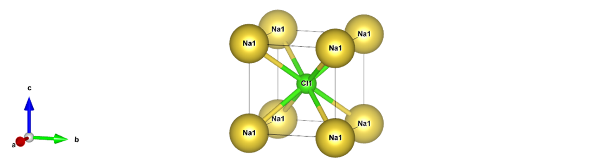
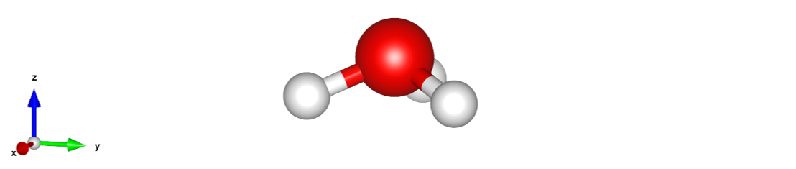

# 数据类型介绍
在 XequiNet 程序中，我们使用的数据点的类型叫做`XequiData`，继承自 PyG 库的`torch_geometric.data.Data`，可以参考[官方文档](​https://pytorch-geometric.readthedocs.io/en/latest/generated/torch_geometric.data.Data.html#torch_geometric.data.Data)

## 基本性质变量
一个`XequiData`数据点表示一个化学分子或周期性体系，包含以下基本的性质变量，（`N`表示原子个数）

| 变量名 | 类型 | 形状 | 描述 |
| - | - | - | - |
| `atomic_numbers` | `int` | `[N,]` | 原子序数 |
| `pos` | `float, double` | `[N,3]` | 原子的笛卡尔坐标 |
| `cell` | `float, double` | `[1,3,3]` | 晶格矢量（可选） |
| `pbc` | `bool` | `[1,3]` | 周期性边界条件（可选） |
| `charge` | `int` | `[1,]` | 净电荷（可选） |
| `spin` | `int` | `[1,]` | 总自旋（2S 或 M-1）（可选） |

### 示例 1：水分子
我们以水分子作为分子的例子，如图所示：


该水分子的 xyz 文件如下：

```
3

O         0.0000        0.0000       -0.1113
H         0.0000       -0.7830        0.4454
H         0.0000        0.7830        0.4454
```

那么代表这个水分子的数据点的各变量为：

```shell
>>> data.atomic_numbers
tensor([8, 1, 1])
>>> data.pos
tensor([[ 0.0000, -0.1113,  0.0000],
        [ 0.0000,  0.4454, -0.7830],
        [ 0.0000,  0.4454,  0.7830]])
```

### 示例 2：氯化钠晶体
周期性体系以 NaCl 晶体为例，如图所示：



POSCAR 如下：

```
Na1 Cl1
1.0
3.502190 0.000000 0.000000
0.000000 3.502190 0.000000
0.000000 0.000000 3.502190
Na Cl
1 1
direct
0.000000 0.000000 0.000000 Na
0.500000 0.500000 0.500000 Cl
```

对应的各变量为：

```shell
>>> data.atomic_numbers
tensor([11, 17])
>>> data.pos
tensor([[ 0.0000, 0.0000, 0.0000],
        [ 1.7510, 1.7510, 1.7510]])
>>> data.cell
tensor([[[3.5022, 0.0000, 0.0000],
         [0.0000, 3.5022, 0.0000],
         [0.0000, 0.0000, 3.5022]]])
>>> data.pbc
tensor([[True, True, True]])
```

注意`pos`需换为笛卡尔坐标，计算方式为`cart_pos = frac_pos @ cell`，（`@`表示矩阵乘法）

### 示例 3：水合氢离子
水合氢离子结构如图：



水合氢离子带一个正电，所以净电荷值为 1：

```shell
>>> data.atomic_numbers
tensor([8, 1, 1, 1])
>>> data.pos
tensor([[ 0.0000,  0.0000,  0.0247]],
        [ 0.4521, -0.7830, -0.3396],
        [ 0.4521,  0.7830, -0.3396],
        [-0.9042,  0.0000, -0.3396]])
>>> data.charge
tensor([1])
```

## 标签性质变量
我们可以向`XequiData`添加标签性质变量用于训练，主要标签性质包含但不限于下表所示：

| 变量名 | 类型 | 形状 | 描述 |
| - | - | - | - |
| `energy` | `float, double` | `[1,]` | 体系的总能量 |
| `forces` | `float, double` | `[N,3]` | 原子核所收到的力，即能量对坐标的负梯度 |
| `base_energy` | `float, double` | `[1,]` | 用于 Δ-ML 的低等级的能量 |
| `base_forces` | `float, double` | `[N,3]` | 用于 Δ-ML 的低等级的力 |
| `virial` | `float, double` | `[1,3,3]` | 位力，即能量对应变的负梯度，也就是应力乘以晶胞体积（注意第一性原理软件计算结果的正负号） |
| `atomic_charges` | `float, double` | `[N,]` | 原子电荷布居 |
| `dipole` | `float, double` | `[1,3]` | 偶极矩矢量 |
| `polar` | `float, double` | `[1,3,3]` | 晶格矢量（可选） |
| `cell` | `float, double` | `[1,3,3]` | 极化率张量 |

在上述性质的基础上，也可以自定义其他性质。不过值得注意的是，对于分子级别的性质（如能量，偶极矩等）需要预留一个维度用于 Batch 操作。具体来说，分子的偶极矩的形状应是`[1, 3]`而非单纯的`[3,]`。
