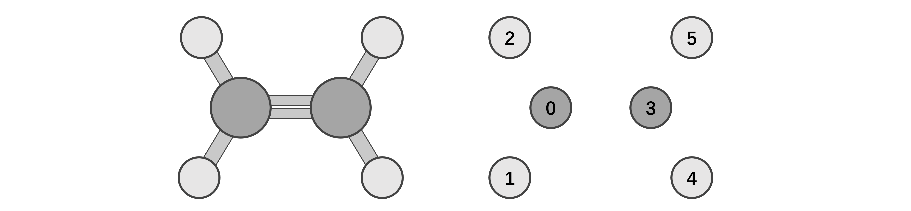
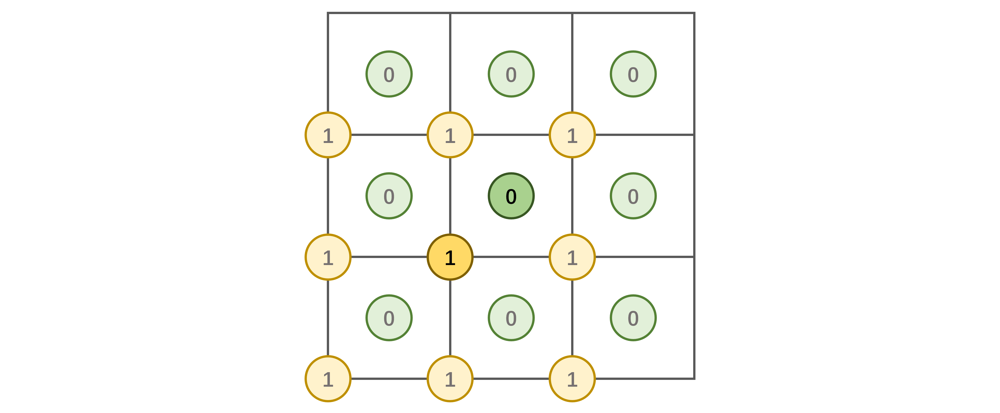
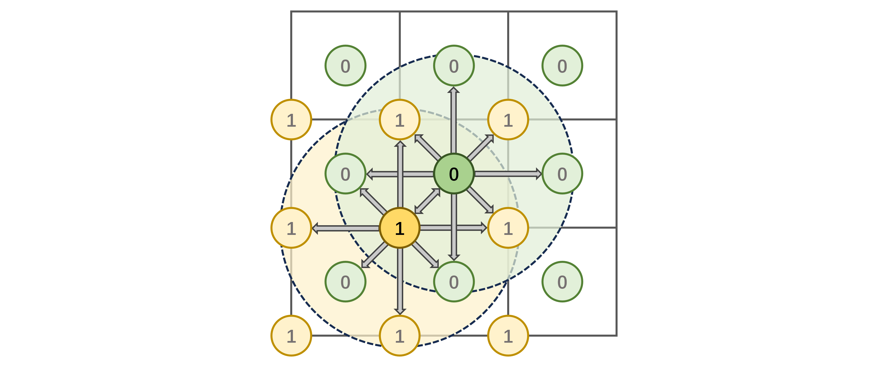
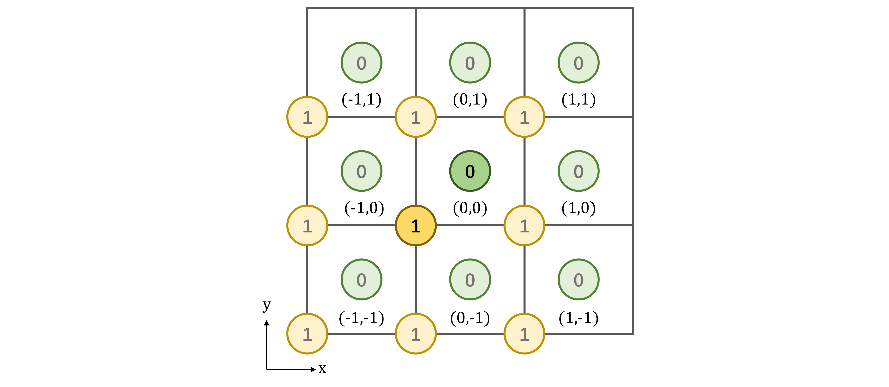

# （扩展）图的建立
## 非周期性图
在建立非周期性分子图时，往往根据截断半径建立键连关系。为方便理解，我们使用平面分子乙烯做为实例，分子结构如图所示：




上图左半部分是乙烯的结构图，但我们知道在输入结构的时候是仅包括原子的坐标信息，而没有化学键的信息，所以实际的输入其实是上图右半部分，每一个球代表一个原子，从 0 开始标号到 5。

然后我们设定一个截断半径，此处为了方便我们设置 2 Å 的截断半径（实际应用当中会更大一些）。先以 0 号碳原子为中心，画一个 2 Å 的球：


我们发现 1、2 和 3 号原子在截断半径内，因此我们从 0 号原子出发，发射一条有向的边到这三个原子，形成三条边，0-1、0-2 和 0-3，我们使用一个名为`edge_index`的整型张量记录，第一行为发射边的原子，第二行为接收边的原子，此时的`edge_index`为：

```shell
>>> edge_index
tensor([[0, 0, 0],
        [1, 2, 3]])
```

类似地，我们继续以 1 号原子为中心连接边，0 和 2 号在半径之内，我们同样连上这两条有向边，1-0 和 1-2，


此时的`edge_index`更新为：

```shell
>>> edge_index
tensor([[0, 0, 0, 1, 1],
        [1, 2, 3, 0, 2]])
```

以此类推，最后完整的乙烯分子图为：


`edge_index`为：

```shell
>>> edge_index
tensor([[0, 0, 0, 1, 1, 2, 2, 3, 3, 3, 4, 4, 5, 5],
        [1, 2, 3, 0, 2, 0, 1, 0, 4, 5, 3, 5, 3, 4]])
```

## 周期性图
周期性体系在构建图的时候会有些许不同，因为原子不仅会和其他原子连接，也会和周期性镜像连接，这里我们在二维周期性下做演示，如图所示“二维氯化钠”晶体：



正中心的正方形的“单胞”中包含一个氯原子，记为 0 号原子，以及一个钠原子，记为 1 号原子。我们对其做周期性扩展，得到的周期性镜像原子用浅色的球表示。虽然看上去很多，但这幅图里其实一共只有两个原子。

我们以 1.8 Å 作为截断半径构建键连关系，得到结果如下：



我们发现 0 号原子不仅和 1 号原子实体有键连关系，还和 1 号原子的镜像有键连，以及自身 0 号原子的镜像也有键连关系。如果用同样的方式来记录`edge_index`，得到的结果为：

```shell
>>> edge_index
tensor([[0, 0, 0, 0, 0, 0, 0, 0, 1, 1, 1, 1, 1, 1, 1, 1],
        [0, 0, 0, 0, 1, 1, 1, 1, 0, 0, 0, 0, 1, 1, 1, 1]])
```

我们发现两个节点之间有多条边连接，这种图称为多重图（Multigraph）。但是这样我们根本分不清是哪一个镜像连接的，在之后计算边的长度的时候也会有很大的麻烦。因此在周期性图表示中，我们额外引入一个称为`cell_offset`的整形张量，用于记录接受边的原子是属于哪一个镜像的，如图所示。(0,0) 表示原始单胞，(a,b) 表示沿 x 方向平移 a 格，y 方向平移 b 格的那个镜像单胞。



在这样的规定下，上述多重图的`cell_offset`为：

```shell
>>> cell_offset
tensor([[-1,  0],
        [ 0, -1],
        [ 1,  0],
        [ 0,  1],
        [ 0,  0],
        [ 1,  0],
        [ 1,  1],
        [ 0,  1],
        [-1, -1],
        [ 0, -1],
        [ 0,  0],
        [-1,  0],
        [-1,  0],
        [ 0, -1],
        [ 1,  0],
        [ 0,  1]])
```

这样我们就可以区分每条边究竟是和哪一个镜像原子相连接的了。当然上述的是二维周期性情况，三维周期性下我们也可以用类似的方法去构建，只是`cell_offset`的维度变为了`[N_edge, 3]`。