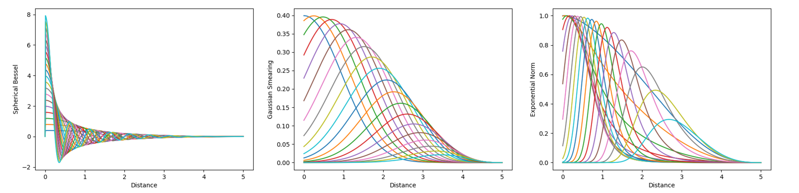
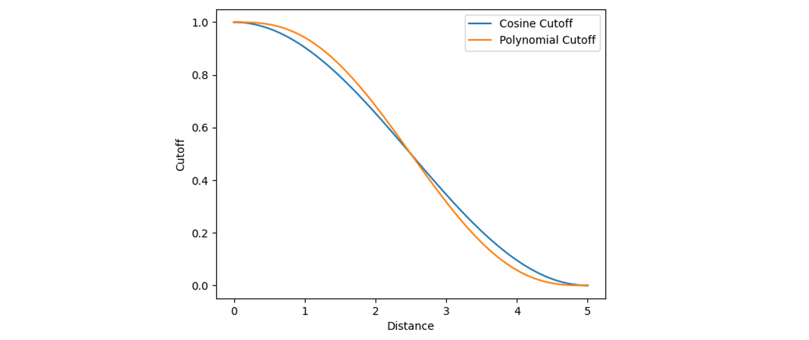

# 模型超参数设置
## 模型选择

| 关键词 | 类型 | 默认值 | 描述 |
| - | - | - | - |
| `model_name` | `str` | `xpainn` | 使用的模型名字 |

现在也没得选，也就 `xpainn` 这一种模型。虽然还有一种叫 `xpainn-ewald`，这个是 XPaiNN 的基础上加了 Ewald-MP （<https://doi.org/10.48550/arXiv.2303.04791>）但是效果没有得到验证，不知道好不好用。

## 模型超参数

| 关键词 | 类型 | 默认值 | 描述 |
| - | - | - | - |
| `model_kwargs` | `dict[str, Any]` | - | 模型具体的超参数 |

这里以字典的形式传递参数。虽然用 `**kwargs` 的形式传递参数是不推荐的行为，但是考虑到输出层的多样性，用 `**kwargs` 传参是最方便的做法了。

### XPaiNN 超参数

- 原子嵌入

| 关键词 | 类型 | 默认值 | 描述 | 可选参数 |
| - | - | - | - | - |
| `embed_basis` | `str` | `gfn2-xtb` | 用于原子嵌入的原子轨道基 | `gfn2-xtb`, `gfn1-xtb`, `one-hot` |
| `aux_basis` | `str` | `aux56` | 原子轨道基投影到的辅助基组 | `aux28`, `aux56` |

这里用的原子嵌入是将 `embed_basis` 投影到 `aux_basis` 上构造的。当然也可以用 `one-hot` 嵌入，其实两者效果差不多都可以用。

- 节点特征

| 关键词 | 类型 | 默认值 | 描述 |
| - | - | - | - |
| `node_dim` | `int` | `128` | 标量特征的长度 |
| `node_irreps` | `str` | `128x0e + 64x1o + 32x2e` | 等变特征的不可约表示 |

`node_dim` 很好理解，就是特征长度。`node_irreps` 指的是不可约表示（Irreducible Representations, Irreps），`128x0e + 64x1o + 32x2e` 表示 128 通道的 0 阶偶宇称不可约表示，加上 64 通道的 1 阶奇宇称不可约表示，加上 32 通道的 2 阶偶宇称不可约表示。具体含义可以看[e3nn/Irreps](https://docs.e3nn.org/en/latest/api/o3/o3_irreps.html)。

- 径向基函数

| 关键词 | 类型 | 默认值 | 描述 | 可选参数 |
| - | - | - | - | - |
| `rbf_kernel` | `str` | `bessel` | 径向基函数类型 | `bessel`, `gaussian`, `expnorm` |
| `num_basis` | `int` | `20` | 径向基函数数量 | |
| `cutoff_fn` | `str` | `cosine` | 平滑截断函数的类型 | `cosine`, `polynomial` |
| `cutoff` | `float` | `5.0` | 截断半径长度 | |

径向基函数的选择还是比较玄学的，比如我在训练时发现球 Bessel 基（<https://doi.org/10.48550/arXiv.2003.03123>）效果比较好，但也有的模型使用 Gaussian 基（<https://doi.org/10.1063/1.5019779>），而有的任务上 Exponential Norm 基（<https://doi.org/10.1021/acs.jctc.9b00181>）又表现不错。所以这里也是调参的一个可选项。

1. 零阶球 Bessel 基，也就是 Sinc 函数：

$$
    R_k \left( r_{ij} \right) = \sqrt{\frac{2}{c}} \frac{\sin\left( f_k r_{ij} \right)}{r_{ij}} u(r_{ij}) \\
    f_k := \frac{k \pi}{c}
$$

2. 高斯函数：

$$
    R_k \left( r_{ij} \right) = \frac{1}{\sigma_k \sqrt{2\pi}} \exp \left[ - \frac{1}{2} \left( \frac{r_{ij} - \mu_k}{\sigma_k} \right)^2 \right] u(r_{ij}) \\
    \mu = \frac{\left( k - 1 \right) c}{N} \quad \sigma := 1
$$

3. ExpNorm，也就是 PhysNet 所使用的径向函数：

$$
    R_k \left( r_{ij} \right) = \exp\left[ -\beta_k \left( \text{e}^{-r_{ij}} - \mu_k \right)^2 \right] u(r_{ij}) \\
    \beta_k = \left[ \frac{2}{k} \left( 1 - \text{e}^{-c} \right) \right]^{-2} \quad \mu_k = 1 - \frac{\left( k - 1 \right) \left( 1 - \text{e}^{-c}\right)}{N}
$$

函数图像可以参考下图：



这几幅图是初始化的图像，并且已经乘上了平滑截断，训练时候会优化参数，但是大致形状应该不会有明显变化。

然后是平滑截断的选择，主要有余弦截断和多项式截断。形状大差不差，都可以用。

余弦截断的表达式为：

$$
    u\left( r_{ij} \right) = \frac{1}{2} \left[ \cos \left( \frac{r_{ij}}{c} \pi \right) + 1 \right]
$$

多项式截断的表达式为：

$$
    u\left( r_{ij} \right) = 1 - 10 \left( \frac{r_{ij}}{c} \right)^3
    + 15 \left( \frac{r_{ij}}{c} \right)^4
    - 6 \left( \frac{r_{ij}}{c} \right)^5
$$

图像如下：




- 其他参数

| 关键词 | 类型 | 默认值 | 描述 | 可选参数 |
| - | - | - | - | - |
| `action_blocks` | `int` | `3` | 消息传递和节点更新的层数 |
| `activation` | `str` | `silu` | 激活函数类型 | `silu`, `relu`, `leakyrelu` |
| `layer_norm` | `bool` | `true` | 是否使用层归一化 |

层数并不是越多越好，可能会有过平滑和过挤压这些问题，3 层基本没啥问题，根据数据量多一层少一层也可以尝试。

激活函数目前的工作 SiLU 用的更多一点，其他的也没有尝试过。

层归一化解决梯度爆炸问题还是非常立竿见影的，值得打开。

- 电子嵌入

| 关键词 | 类型 | 默认值 | 描述 |
| - | - | - | - |
| `charge_embed` | `bool` | `false` | 是否使用电荷嵌入层 |
| `spin_embed` | `bool` | `false` | 是否使用自旋嵌入层 |

来自 SpookyNet（<https://doi.org/10.1038/s41467-021-27504-0>），用于处理带电荷和自旋的体系，这个实际的好处时，当体系净电荷为中性以及不具有自旋的时候，这一部分对模型没有实际贡献，因此可以兼容不带电荷的模型。所以当体系没有相关电荷和自旋输入时，会自动跳过相关模块，而结果不会改变。

- 输出相关

| 关键词 | 类型 | 默认值 | 描述 | 可选参数 |
| - | - | - | - | - |
| `output_mode` | `str`/`list[str]` | `energy` | 输出层的类型，可以有多重输出 | `energy`, `charges`, `polar`, `dipole`, `polar` |
| `hidden_dim` | `int` | `64` | 输出层 MLP 的中间层维度 | |
| `hidden_irreps` | `str` | `64x0e + 32x1o + 16x2e` | 张量输出的 等变 MLP 中间层不可约表示 | |
| `conservation` | `bool` | `true` | 电荷布居输出专用，是否遵循电荷守恒 | |
| `magnitude` | `bool` | `false` | 偶极矩输出专用，是否转化为偶极矩大小 | |
| `isotropic` | `bool` | `false` | 极化率输出专用，是否转化为各项同性极化率 | |

可以支持 Multi-task（同时学能量和力不算 Multi-task），比如同时学能量和电荷布局，此时可以这么指定：

```yaml
model:
  model_name: xpainn
  model_kwargs:
    ...
    output_mode: [energy, charges]
    conservation: true
  ...
```

目前的 Multi-task 的设计是，除了输出层以外其他部分参数共享。


## 单位设置

| 关键词 | 类型 | 默认值 | 描述 |
| - | - | - | - |
| `default_units` | `dict[str, str]` | - | 模型使用的默认单位 |

设置模型所使用的单位，具体可用单位见[单位](./units.md)。主要就是输入结构的坐标的单位，和输出物理量的单位，如：

```yaml
model:
  ...
  default_units:
    pos: Angstrom
    energy: eV
```

表述输入坐标单位是 Å，输出能量单位是 eV。要注意的是对于梯度性质，比如力，会自动根据能量和坐标的单位组合出 eV/Å，不要单独指定以免引起歧义。
