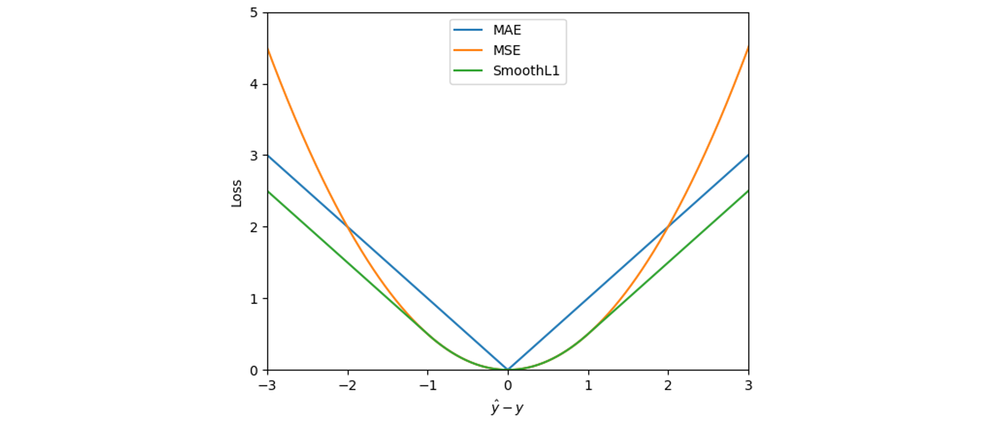
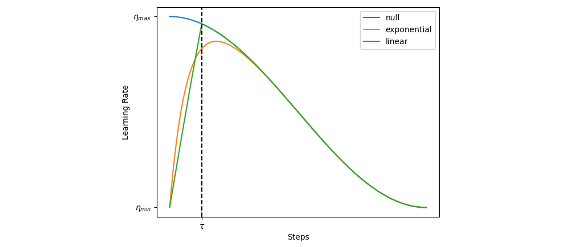
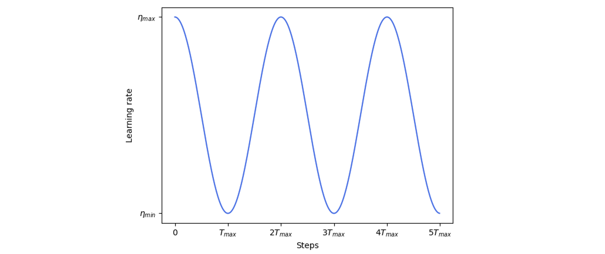
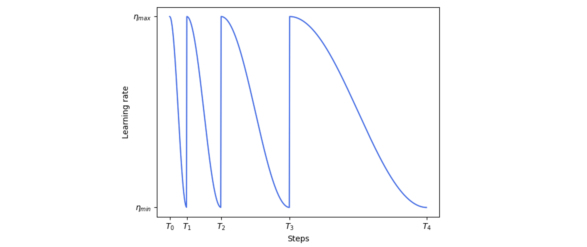

# 训练参数设置
## 检查点文件

| 关键词 | 类型 | 默认值 | 描述 |
| - | - | - | - |
| `run_name` | `str` | `xequinet` | 训练任务的名称，检查点文件将以此命名 |
| `resume` | `bool` | `false` | 是否断点续训 |
| `ckpt_file` | `str` | `null` | 用于载入参数的检查点文件名 |
| `finetune_modules` | `list[str]` | `null` | 含有列表中关键词的模型参数才会被优化 |

### 示例 1：断点续训
```yaml
trainer:
  run_name: spice-v1
  ckpt_file: spice-v1_last.pt
  resume: true
```
训练开始时会读取 `spice-v1_last.pt` 检查点文件，读取模型参数的同时，还会读取 Epoch 信息，优化器参数和学习率调整器的参数等。接着从检查点文件断开的 Epoch 开始继续训练。

### 示例 2：微调模型
```yaml
trainer:
  run_name: spice-v2
  ckpt_file: spice-v1.pt
  resume: false
  finetune_modules: [output, embed]
  ...
```
训练开始时将会读取 `spice-v1.pt` 检查点文件，只载入其中的模型参数。训练过程中仅优化名字中带有 `output` 和 `embed` 的参数（如 `module.mods.embedding.embedding.1.weight` 和 `module.mods.output_energy.out_mlp.0.weight` 等）。接着从头开始训练。训练过程中保存的参数将会命名成 `spice_v2_0.pt` 和 `spice_v2_last.pt` ，前者是验证误差最好的模型，后者是上一个 Epoch 结束时自动保存的检查点模型。

## 损失函数

| 关键词 | 类型 | 默认值 | 描述 | 可选参数 |
| - | - | - | - | - |
| `lossfn` | `str` | `smoothl1` | 损失函数类型（不区分大小写）|  `mae`(`l1`), `mse`(`l2`), `smoothl1` |
| `losses_weight` | `dict[str, float]` | - | 误差函数各项组分的权重 |

### 损失函数种类
这里可以用的损失函数有三种，L1 Loss、L2 Loss 和 两者兼具的 SmoothL1 Loss。三者的函数形式和图像如下（图中为了美观给 L2 Loss 乘了一个 0.5 的系数）：



- MAE Loss，即 L1 Loss：

$$
    l \left( \hat{y}, y \right) = \left| \hat{y} - y \right|
$$

- MSE Loss，即 L2 Loss：

$$
    l \left( \hat{y}, y \right) = \left( \hat{y} - y \right)^2
$$

- SmoothL1 Loss：

$$
    l \left( \hat{y}, y \right) = \begin{cases}
        0.5 \left( \hat{y} - y \right)^2    & \left| \hat{y} - y \right| > 1 \\
        \left| \hat{y} - y \right| - 0.5 & \left| \hat{y} - y \right| \le 1 \\
    \end{cases}
$$

式中 $\hat{y}$ 表示真值，$y$ 表示预测值。

### 损失权重
`losses_weight` 接受一个字典，用于给损失函数的各组分分配一个权重。比较常见的情况时训练力场模型时同时监督能量和力，我们希望能量和力误差的权重比时 1:1000，就可以这样设置：
```yaml
trainer:
  ...
  lossfn: smoothl1
  losses_weight:
      energy: 1.0
      forces: 1000.0
  ...
```
这样就代表着总损失 $\mathcal{L} = 1 \times l \left( \hat{E}, E \right) + 1000 \times l \left( \hat{\mathbf{F}}, \mathbf{F} \right)$。

当然 `energy` 和 `forces` 须在数据参数的 `target` 栏中声明，这样程序才会从数据集中读取相应的标签用于损失计算。

## 优化器
| 关键词 | 类型 | 默认值 | 描述 | 可选参数 |
| - | - | - | - | - |
| `optimizer` | `str` | `AdamW` | 优化器类型（不区分大小写）| `Adam`, `AdamW`, `NAdam`, `RAdam` |
| `optimizer_kwargs` | `dict` | `{}` | 传给优化器的参数，可见 [torch.optim](https://pytorch.org/docs/stable/optim.html#algorithms) | |

### 优化器种类
Adam 宇宙了说是。
- `Adam`：通常来说 Adam 作为通用首选应该是没什么问题了，适应大多数任务
- `AdamW`：就是加了 Weight Decay 的 Adam，相比之下**修正了权重衰减的实现方式**，因此需要加权重衰减的时候记得使用 AdamW
- `NAdam`：在 Adam 基础上融合 Nesterov 动量，适用于需要快速收敛的任务（如小数据集训练）。
- `RAdam`：在训练初期对自适应学习率进行方差修正，适合训练初期需要稳定的任务（如小批量数据）。

### 示例
```yaml
trainer:
  ...
  optimizer: AdamW
  optimizer_kwargs:
    betas: [0.9, 0.999]
    weight_decay: 0.01
  ...
```
这样设置的话，就会使用 `AdamW` 优化器，参数设置上 `betas=(0.9, 0.99)`、`weight_decay=0.1`（YAML 文件没有 Tuple，这里所幸传 List 进 Optimizer 也能跑）

## 学习率

| 关键词 | 类型 | 默认值 | 描述 |
| - | - | - | - |
| `max_lr` | `float` | `5e-4` | 学习率最大值 |
| `min_lr` | `float` | `0.0` | 学习率最小值 |

学习率变化的上限和下限，在不同的学习率调整器下含义各不相同。

## 学习率预热

| 关键词 | 类型 | 默认值 | 描述 | 可选参数 |
| - | - | - | - | - |
| `warmup_scheduler` | `str` | `linear` | 学习率预热方式（不区分大小写） | `null`, `linear`, `exponential`, `untuned_linear`, `untuned_exponential`, `RAdam` |
| `warmup_epochs` | `int` | `10` | 学习率预热 Epoch 数 | - |

学习率预热是使用的 [pytorch-warmup](https://pypi.org/project/pytorch-warmup/) 库，简单来说就是将学习率缓缓从 0 开始上升，避免初始学习率过大导致训练不稳定的问题。`warmup_epochs` 仅针对 `linear` 和 `exponential` 生效，程序会将预热的 Epoch 数量换算成梯度下降的步数。以余弦学习率变化为例，下图为 2500 步（不是 Epoch）预热的学习率变化图：



相当于在学习率上 $\eta_t$ 乘上一个预热系数 $\omega_t \in \left[ 0, 1 \right]$，即

$$
    \hat{\eta}_t = \eta_t \cdot \omega_t
$$

### 线性预热
线性预热分两种，手动设置预热步数的 `linear` 和自动根据 Adam 类优化器的 $\beta_2$ 值设定预热步数的 `untuned_linear`。其预热系数为：

$$
    \omega_t = \min \left( 1, \frac{t}{\tau} \right)
$$

其中，$t$ 为当前步数，$\tau$ 为预热步数，对于 `untuned_linear`，$\tau = \lfloor \frac{2}{1-\beta_2} \rfloor$

### 指数预热
指数预热同样分两种，预热系数为（这里和官方不一样，官方这里没有 2，我这里是为了和 `untuned_exponential` 保持一致）：

$$
    \omega_t = 1 - \exp \left( -\frac{2t}{\tau} \right)
$$

同样，$t$ 为当前步数，$\tau$ 为预热步数，对于 `untuned_exponential`，$\tau = \lfloor \frac{2}{1-\beta_2} \rfloor$

### RAdam 预热
这个有点复杂，懒得写了，看[官方解释](https://tony-y.github.io/pytorch_warmup/v0.2.0/radam_warmup.html)吧🤭


## 学习率调整器

| 关键词 | 类型 | 默认值 | 描述 | 可选参数 |
| - | - | - | - | - |
| `lr_scheduler` | `str` | `cosine_annealing` | 学习率调整方式（不区分大小写） | `cosine_annealing`(`cosine`), `cosine_annealing_warm_restarts`<br>(`cosine_restarts`), `reduce_on_plateau`(`plateau`) |
| `lr_scheduler_kwargs` | `dict` | `{}` | 传给学习率调整器的参数 | - |

### 余弦退火
学习率按余弦函数周期性调整，当前第 $t$ 步的学习率 $\eta_t$ 为：

$$
    \eta_t = \eta_{\min} + \frac{1}{2} \left( \eta_{\max} - \eta_{\min} \right) \left( 1 + \cos{\frac{t}{T_{\max}} \pi} \right)
$$

式中 $\eta_{\min}$ 和 $\eta_{\max}$ 分别表示最小和最大学习率，$T_{\max}$ 表示余弦函数变化的半周期，学习率变化情况如图所示：



尽管上述公式和图像中 `T_max` 表示半周期的**步数**，但是我们一般更想根据 Epoch 数调整，因此参数设置时 `T_max` 指的是半周期 **Epoch 数**，程序会自动调整为步数传给学习率调整器。

```yaml
trainer:
  ...
  max_lr: 1e-3
  min_lr: 0.0
  lr_scheduler: cosine_annealing  # cosine
  lr_scheduler_kwargs:
    T_max: 300
  ...
```

上述示例即为半周期为 300 **Epochs** 的余弦退火学习率调整器，学习率变化的范围为 0.0 到 1e-3。

从使用体验上来说，余弦退火学习率效果还是比较稳定的，用起来也比较省心。

### 余弦退火热重启
与余弦退火不同，余弦退火冷重启到谷底时是慢慢回升到学习率最大值，而热重启到谷底时会立刻回到最大学习率。

$$
    \eta_t = \eta_{\min} + \frac{1}{2} \left( \eta_{\max} - \eta_{\min} \right) \left( 1 + \cos{\frac{t - T_k}{T_{k+1} - T_k} \pi} \right) \quad T_k \le t < T_{k+1}
$$

但是每次余弦下降的半周期都会变为原先的 $\mu$ 倍，即 $T_{k+1} - T_k = \mu^k \tau$，$\tau$ 为初始半周期。更直观的学习率变化图如图所示：



使用方法为:

```yaml
trainer:
  ...
  max_lr: 1e-3
  min_lr: 0.0
  lr_scheduler: cosine_restarts  # cosine_annealing_warm_restarts
  lr_scheduler_kwargs:
    T_0: 50
    T_mult: 2
  ...
```
这里 `T_0` 指初始半周期 **Epoch 数**，程序也同样会自动调整为步数，`T_mult` 指的是，每次重启之后半周期值都会乘以这个数，这里设置成 2，意思是每次重启，半周期都变为原来的两倍。


### 学习率平台衰减
当验证集误差连续若干 Epoch 未改善时，将学习率降低，直到学习率小于预设的最小学习率时结束训练。直接举例说明：

```yaml
trainer:
  ...
  max_lr: 1e-3
  min_lr: 1e-6
  lr_scheduler: reduce_on_plateau  # plateau
  lr_scheduler_kwargs:
    factor: 0.5
    patience: 50
  ...
  ```
意思是学习率从 1e-3 开始，如果连续 50 个 Epoch 验证集误差没有改善，就将学习率乘以 0.5，直到学习率小于 1e-6 停止训练。


## 其他参数

| 关键词 | 类型 | 默认值 | 描述 |
| - | - | - | - |
| `max_epochs` | `int` | `300` | 最大训练 Epoch 数量 |
| `grad_clip` | `float` | `null` | 梯度裁剪数值，确保参数梯度的范数不超过该设定值 |
| 